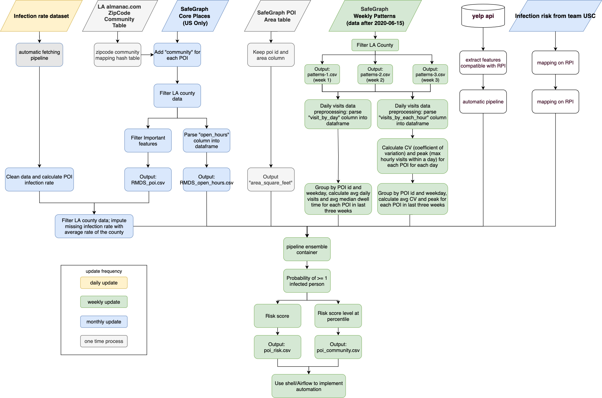

# RMDS_COVID19_riskgenerator
## Project structure
This is project produce a risk score and risk lever according to POI (Point of Interest) data gather from [SafeGraph](https://www.safegraph.com/), COVID-19 cases from [lacounty.gov](http://dashboard.publichealth.lacounty.gov/covid19_surveillance_dashboard), and external dataset such as Yelp API. The project structure is as follows:


## How to use this script

 1. Clone the whole repository from GitHub

 2. Pre-Download data:
 A total of 7 files need to download (Don't worry, we have example data for you in the future!). Store all the data into `/data/external/` folder
    * Data from SafeGraph.com: Need to apply an account
        * **Consecutive 3 weeks of user patterns**: Weekly Places Patterns (1-3)
        
        * **POI (Point of Interest) data**: Core Places (US Only) (4)
         
    * Third party precalculated data saved in SafeGraph.com:
        * **POI area square foot data**: Need to download from AWS CLI (stored in S3) (5)
        ```aws s3 cp s3://sg-c19-response/geo-supplement/May2020Release/SafeGraphPlacesGeoSupplementSquareFeet.csv.gz <your_local_path> --profile safegraphws --endpoint https://s3.wasabisys.com```
    * **infection cases and death cases** from [lacounty.gov](http://dashboard.publichealth.lacounty.gov/covid19_surveillance_dashboard/)
        * Click `[Table: Community Case/Death]`, then click download (6)
        * Click `[Table: Community Testing]`, then click download (7)
        

3. Check necessary dependencies in `requirements.txt` 
```
pip install -r requirements.txt
```
4. Run the script:
Go to the folder where you clone the files:
    * Get processed data
    ```Python
    python src/python/export_data.py
    ```
    * You will get RMDS_open_hours.csv, RMDS_poi_area_square_feet.csv, RMDS_poi.csv, and RMDS_zipcode_mapper.json
    * Get the risk score
    ```R
    R CMD BATCH functions.R
    R CMD BATCH test.R
    ```
    * You will get risk score in `data/result` folder

